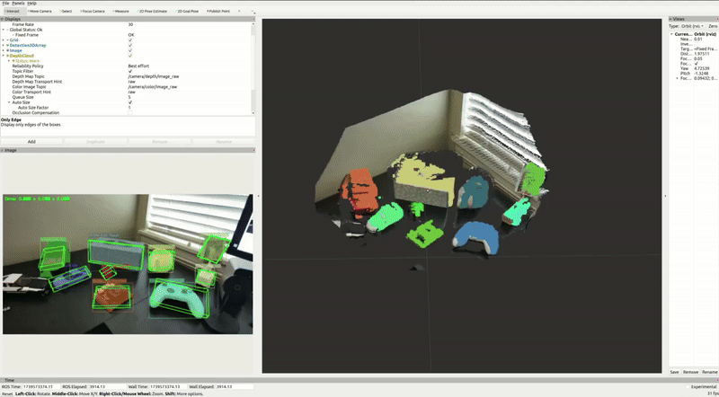
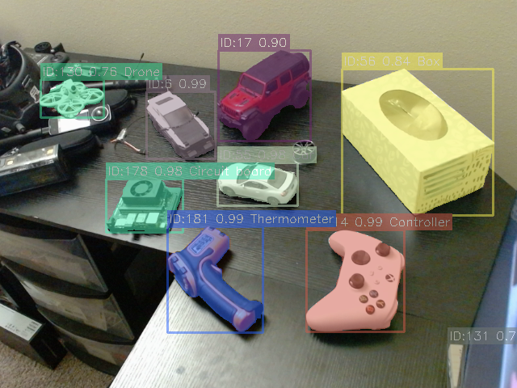

```
██╗   ██╗███████╗ ██████╗████████╗ ██████╗ ██████╗ 
██║   ██║██╔════╝██╔════╝╚══██╔══╝██╔═══██╗██╔══██╗
██║   ██║█████╗  ██║        ██║   ██║   ██║██████╔╝
╚██╗ ██╔╝██╔══╝  ██║        ██║   ██║   ██║██╔══██╗
 ╚████╔╝ ███████╗╚██████╗   ██║   ╚██████╔╝██║  ██║
  ╚═══╝  ╚══════╝ ╚═════╝   ╚═╝    ╚═════╝ ╚═╝  ╚═╝
    ╔═╗┌─┐┬─┐┌─┐┌─┐┌─┐┌┬┐┬┌─┐┌┐┌
    ╠═╝├┤ ├┬┘│  ├┤ ├─┘ │ ││ ││││
    ╩  └─┘┴└─└─┘└─┘┴   ┴ ┴└─┘┘└┘
```

# Perception Stack for General Robotics Application

A comprehensive computer vision and perception package for robotics applications, featuring real-time 2D segmentation, object tracking, and image analysis capabilities.

## Features

- Real-time 2D segmentation using FastSAM
- Object tracking with BoT-SORT
- Texture-based filtering and analysis
- Zero-shot object semantic labeling using GPT-4 Vision
- TensorRT model export support
- Comprehensive visualization tools

## Demo


3D pointcloud segmentation using 2D segmentation masks and depth from ToF sensor


Real-time object tracking and semantic segmentation on diverse objects with zero-shot capabilities


## Installation

### Prerequisites

- Python 3.8+
- CUDA-compatible GPU (recommended)
- OpenCV
- PyTorch

### Dependencies

```bash
pip install -r requirements.txt
```

Required packages:
- ultralytics>=8.3.70
- filterpy>=1.4.5
- scipy>=1.15.1
- torch>=2.0.0
- torchvision>=0.10.0
- openai>=1.61.0

### Package Installation

Install the package in development mode:

```bash
git clone https://github.com/alexlin2/vector_perception.git
cd vector_perception
pip install -e .
```

## Usage

### 2D Segmentation API (sam_2d_seg.py)

The `Sam2DSegmenter` class provides a high-level interface for real-time object segmentation and tracking.

#### Basic Usage

```python
from vector_perception.segmentation import Sam2DSegmenter

# Initialize segmenter with default settings
segmenter = Sam2DSegmenter(
    model_path="models/FastSAM-s.engine",
    device="cuda",
    min_analysis_interval=5.0,
    use_tracker=True,
    use_analyzer=True
)

# Process a single frame
masks, bboxes, target_ids, probs, names = segmenter.process_image(frame)

# Visualize results
overlay = segmenter.visualize_results(
    frame, masks, bboxes, target_ids, probs, names
)
```

#### Configuration Options

The `Sam2DSegmenter` class accepts several configuration parameters:

- `model_path`: Path to the FastSAM model file (default: "models/FastSAM-s.engine")
- `device`: Computation device ("cuda" or "cpu")
- `min_analysis_interval`: Minimum time between object analysis requests (seconds)
- `use_tracker`: Enable/disable object tracking
- `use_analyzer`: Enable/disable GPT-4 Vision analysis

#### Advanced Usage

```python
# Initialize with custom settings
segmenter = Sam2DSegmenter(
    model_path="models/FastSAM-s.engine",
    device="cuda",
    min_analysis_interval=4.0,
    use_tracker=True,
    use_analyzer=True
)

# Process video stream
while True:
    ret, frame = cap.read()
    if not ret:
        break
        
    # Process frame
    masks, bboxes, target_ids, probs, names = segmenter.process_image(frame)
    
    # Run analysis if needed
    if segmenter.use_analyzer:
        segmenter.run_analysis(frame, bboxes, target_ids)
        names = segmenter.get_object_names(target_ids, names)
    
    # Visualize
    overlay = segmenter.visualize_results(
        frame, masks, bboxes, target_ids, probs, names
    )
    
    # Cleanup
    segmenter.cleanup()
```

### Model Export (export_tensorrt.py)

The `export_tensorrt.py` script provides functionality to export YOLO or FastSAM models to ONNX or TensorRT formats.

```bash
# Export to ONNX
python export_tensorrt.py --model_path path/to/model.pt --model_type fastsam --format onnx

# Export to TensorRT
python export_tensorrt.py --model_path path/to/model.pt --model_type fastsam --format engine
```

Parameters:
- `--model_path`: Path to the model weights
- `--model_type`: Type of model to export ('yolo' or 'fastsam')
- `--format`: Export format ('onnx' or 'engine')

## Package Structure

```
vector_perception/
├── segmentation/
│   ├── sam_2d_seg.py       # Main segmentation interface
│   ├── utils.py            # Utility functions
│   └── detection2d_tracker.py  # Object tracking
├── image_analyzer.py        # GPT-4 Vision integration
├── export_tensorrt.py      # Model export utilities
├── requirements.txt
└── setup.py
```

## API Reference

### Sam2DSegmenter

#### Methods

- `process_image(image)`: Process a single frame and return segmentation results
- `run_analysis(frame, bboxes, target_ids)`: Run object analysis on detected objects
- `get_object_names(track_ids, tracked_names)`: Get object names for tracked IDs
- `visualize_results(image, masks, bboxes, track_ids, probs, names)`: Generate visualization
- `cleanup()`: Clean up resources

### ImageAnalyzer

#### Methods

- `analyze_images(images, detail="auto")`: Analyze cropped images using GPT-4 Vision
- `encode_image(image)`: Encode image to Base64 format

## Contributing

Contributions are welcome! Please feel free to submit a Pull Request.

## License

[Add your license information here]

## Acknowledgments

This project uses the following open-source packages:
- FastSAM
- Ultralytics
- OpenAI GPT-4 Vision
- OpenCV